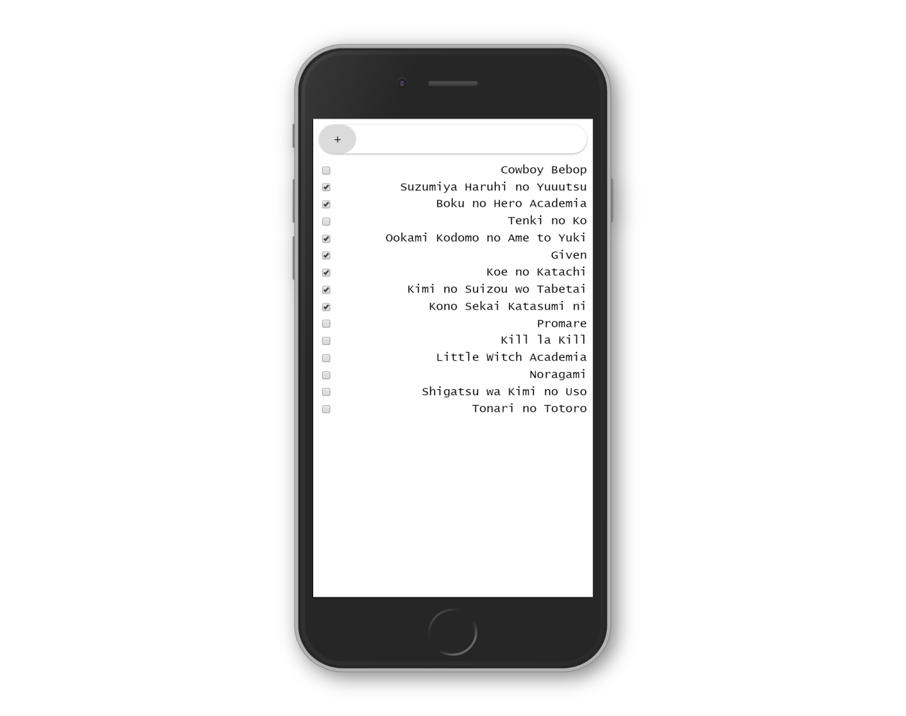

# React To-do

> My personal README template.

[//]: # (Screenshot, Application concept art etc)


[//]: # (Live Demo link)
<p align="center">
  <a href="https://juz-react-todo.netlify.com/">Live Demo</a>
</p>

## Built With

* HTML
* CSS
* React

## Get Started

### Setup

1. Clone this repository.

```bash
git clone git@github.com:juzQrios/react-todo.git
```

2. Install dependencies.

```bash
npm install
```

3. Start local server.

```bash
npm start
```

4. Open <http://localhost:3000/> in a browser.

### Tests

While it is a good practice to test code, this project doesn't have any tests right now but I might add them in future.

### Deployment

## Contributing

Contributions, issues and feature requests are welcome!

Feel free to checkout this project's [Kanban board](https://github.com/juzQrios/react-todo/projects/1) or [issues page](https://github.com/juzQrios/react-todo/issues).

## Acknowledgments

* [create-react-app](https://github.com/facebook/create-react-app)

## License

This project is [MIT](./LICENSE) licensed.

## Authors

#### Darshan

* GitHub: [@juzQrios](https://github.com/juzQrios)
* LinkedIn: [Darshan J](https://www.linkedin.com/in/jayadevdarshan/)
* Email: <dj30c.1@gmail.com>
